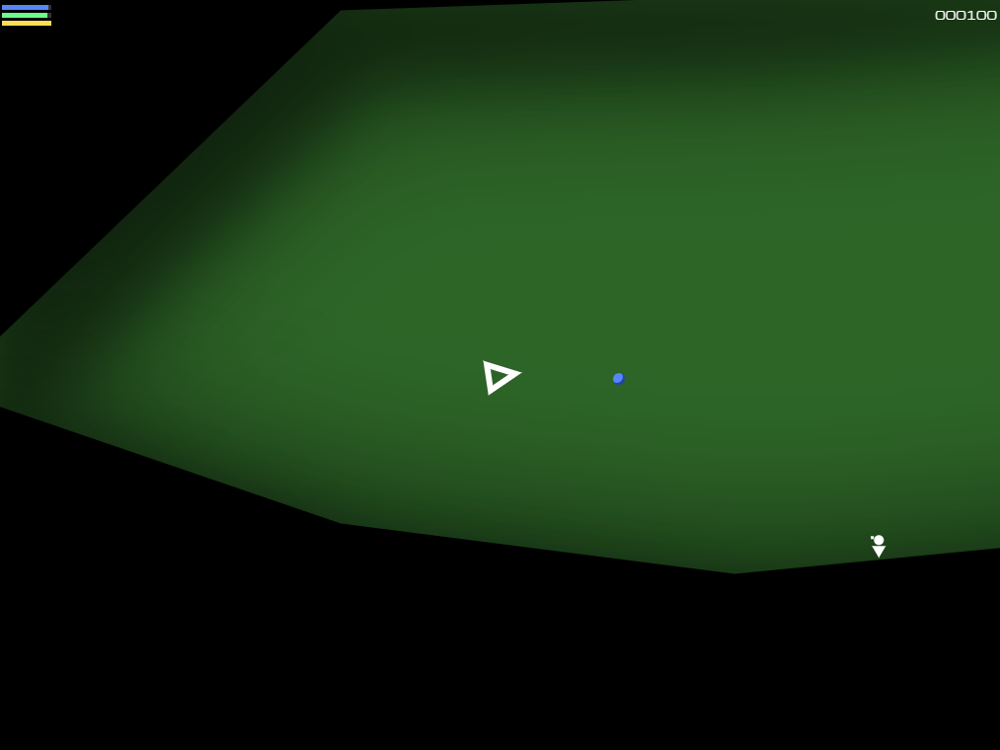

# Fort Akopalueze

Ein browserbasiertes 2D-Raumschiff-Actionspiel im Retro-Style. Du steuerst ein kleines Raumschiff durch prozedural generierte Höhlen, kämpfst gegen Wachdrohnen, Geschütztürme, Minen und Laser-Barrieren – und musst am Ende den Reaktor zerstören und entkommen.

## Steuerung

| Taste | Aktion |
|---|---|
| `↑` | Schub vorwärts |
| `↓` | Schub rückwärts |
| `←` / `→` | Rotieren |
| `Shift` + `←` / `→` | Gleiten (Strafe) |
| `Leertaste` | Schießen |
| `ESC` | Menü |

## Gegner

| Typ | Verhalten |
|---|---|
| Wachdrohne | Patrouilliert, verfolgt und schießt bei Sichtkontakt |
| Geschützturm | Stationär, dreht Lauf zum Spieler, schießt bei freier Sicht |
| Mine | Stationär, explodiert bei Annäherung des Spielers |
| Laser-Barriere | Gepulster Strahl von Decke zu Boden, zerstört Projektile |

## Ressourcen

| Ressource | Farbe | Verlust | Game-Over |
|---|---|---|---|
| **Energie** | Blau | Sinkt beim Thrusten (↑/↓) | Bei 0 sofort tot |
| **Schild** | Grün | Treffer von Projektilen, Laser, Kollision | Bei 0: nächster Treffer = Tod |
| **Munition** | Gelb | Pro Schuss | Kein Schießen mehr möglich |

## Power-ups

Farbige Kugeln in den Räumen. Aufsammeln durch Überfahren (+25 %).

| Farbe | Effekt |
|---|---|
| Blau | +Energie |
| Grün | +Schild |
| Gelb | +Munition |
